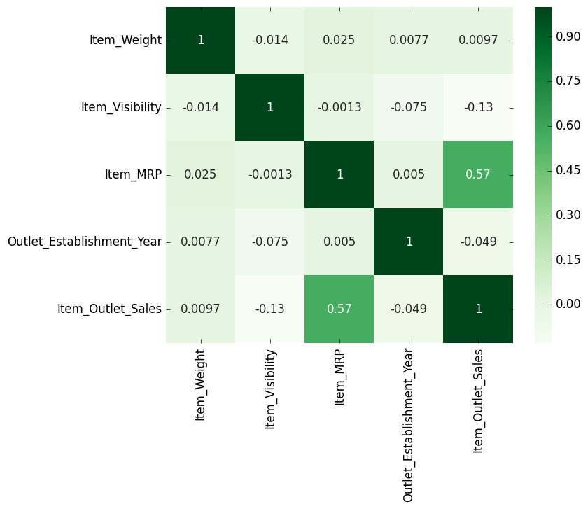

# Food Sales Predictions
## Predict Outlet Sales with Dataset

**Author**: Tyler Brown

### Business Problem:
Retailer would like to predict sales utilizing the properties of products and outlets provided in the dataset. The retailer will be able to use the model metrics to determine how accurate the predictions are for future outlet sales.

### Data:
File sales_predictions.csv within the repository contains data used for determining sales predictions. The original data is provided by https://datahack.analyticsvidhya.com/contest/practice-problem-big-mart-sales-iii/
To help the retailer, our goal is to predict the "Item_Outlet_Sales" column. The remaining columns will be used to determine the prediction.

## Methods:
-"Item_Identifier" column was dropped from the dataset due to unique categorical values, which would cause errors in making predictions.

-Fill missing values in column "Item_Weight" with the median numerical value. The percentage of data loss is high and would have a big impact on the results.

-Fill missing values in column "Outlet_Size" with the median categorical value "Medium". The percentage of data loss is high and would have a big impact on the results.

-Column "Item_Fat_Content" contains inconsistent categories, where "LF" and "low fat" can translate to "Low Fat". Similarly, "reg" can translate to "Regular".

## Results:
#### Amount Per Item Type

All item types presented in the data are displayed to visualize the difference in the amount of each item type.

#### Item Visibility Amount per Item Fat Content

The graph displays the Item Fat Content when compared with its visibility from the dataset.

#### Item Visibility Correlation within Dataset

From the correlation graph, we can determine little correlation between most of the columns in the dataset. The best correlation between two different columns of data would be "Item_Outlet_Sales", which is our goal for predictions, and "Item_MRP".

## Recommendations:
When comparing the two models above, I recommend implementing the Regression Tree model. From the metrics shown above, the R squared matrix in the model can account for about 60% of the variation in the test target using the features. Additionally, the Root Mean Squared Error matrix in the model shows a small margin of error in relation to the training data and testing data.

## Limitations & Next Steps:
- Presented with missing values in the dataset
- No additional data is available for greater accuracy in predictions

The next steps would be to inform the retailer on the results of predictions based on the dataset. If satisfied, the retailer can use these predictions and determine future value in sales for the business.
If displeased, the retailer can make necessary arrangements to produce greater value in sales.

### For further information...
If there are any additional questions, I can be contacted at alpha.curse@gmail.com
